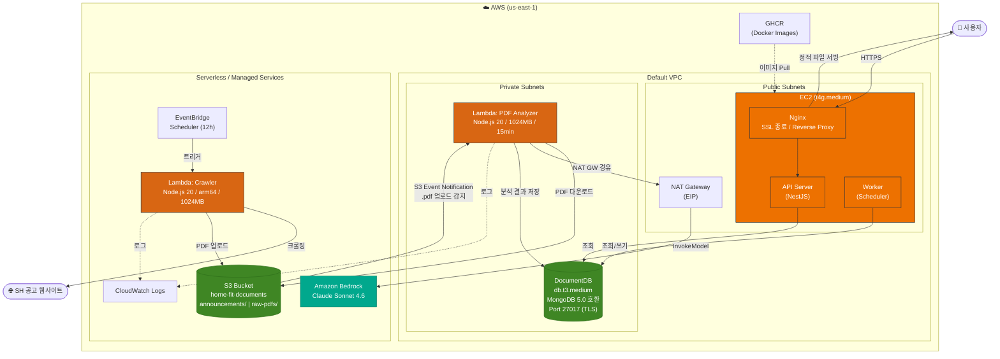

# Home Fit

서울주택도시공사(SH) 임대/분양 공고를 자동 수집·분석하여, 사용자 맞춤형 Q&A 기반 주거 정보를 제공하는 서비스입니다.

> 🌐 https://homefit1403.site

---

## 서비스 개요

1. **크롤러**가 SH 공고 게시판에서 PDF를 자동 수집하여 S3에 저장
2. **PDF 분석기**가 Bedrock Claude Sonnet을 활용해 공고 내용을 구조화된 Q&A 데이터로 변환
3. **API 서버**가 분석된 데이터를 사용자에게 제공
4. **웹 앱**에서 온보딩 → 공고 목록 → Q&A 형태로 사용자에게 맞춤 정보 전달

---

## 기술 스택

| 레이어 | 기술 |
|--------|------|
| Frontend | React 18, TypeScript, Vite 7, TailwindCSS 4, React Router 7 |
| Backend API | NestJS 10, TypeScript, Mongoose 8, Swagger |
| Worker | NestJS ApplicationContext (백그라운드 스케줄러) |
| Database (로컬) | MongoDB 8.0 (Docker) |
| Database (운영) | AWS DocumentDB (MongoDB 5.0 호환) |
| Crawler Lambda | Node.js 20, @aws-sdk/client-s3, Cheerio |
| PDF Analyzer Lambda | Node.js 20, @aws-sdk/client-bedrock-runtime, mongodb |
| Reverse Proxy | Nginx 1.29 (SSL 종료, 정적 파일 서빙) |
| IaC | Terraform |
| CI/CD | GitHub Actions → EC2 |
| Container | Docker, Docker Compose |
| Package Manager | npm workspaces |

---

## 프로젝트 구조

```
home-fit/
├── apps/
│   ├── api/                  # NestJS REST API + Worker
│   │   ├── src/
│   │   │   ├── announcements/   # 공고 관리
│   │   │   ├── qa/              # Q&A 상태 머신
│   │   │   ├── glossary/        # 용어 사전
│   │   │   ├── health/          # 헬스체크
│   │   │   ├── worker-jobs/     # 워커 작업 관리
│   │   │   ├── worker/          # 워커 엔트리
│   │   │   └── database/        # DB 연결
│   │   ├── main.ts              # API 서버 엔트리
│   │   └── worker.ts            # Worker 프로세스 엔트리
│   ├── web/                  # React SPA
│   │   └── src/
│   │       ├── pages/           # HomePage, OnboardingPage, AnnouncementsPage, QuestionsPage, MyProfilePage
│   │       ├── components/      # 공통 컴포넌트
│   │       ├── utils/           # QA 상태 머신, 필터링, 유효성 검사
│   │       └── types/           # 타입 정의
│   ├── crawler/              # SH 공고 PDF 크롤러 (Lambda)
│   └── lambda-pdf-analyzer/  # PDF 분석기 (Lambda + Bedrock)
├── aws-infra/                # Terraform IaC
│   ├── main.tf                  # EC2, Security Group, Key Pair
│   ├── networking.tf            # Private Subnets, NAT Gateway, Route Tables
│   ├── s3.tf                    # S3 Bucket, Event Notification
│   ├── lambda.tf                # Lambda Function, IAM Role
│   ├── documentdb.tf            # DocumentDB Cluster
│   ├── variables.tf             # 변수 정의
│   └── outputs.tf               # 출력 정의
├── infra/
│   └── nginx/                # Nginx 설정 (로컬/운영)
├── .github/workflows/
│   └── deploy.yml            # CI/CD 파이프라인
├── docker-compose.yml        # 로컬 개발 환경
└── docker-compose.prod.yml   # 운영 환경
```

---

## AWS 아키텍처



### 데이터 흐름

```
① EventBridge (12h 주기) → Crawler Lambda → SH 웹사이트 크롤링 → PDF 다운로드 → S3 업로드
② S3 Event Notification (.pdf 업로드 감지) → PDF Analyzer Lambda 트리거
③ PDF Analyzer Lambda → S3에서 PDF 다운로드 → NAT GW → Bedrock Claude Sonnet 4.6 (분석 요청)
④ Bedrock 분석 결과 → Lambda → DocumentDB 저장 (Q&A 상태 머신, 공고 정보, 용어 사전)
⑤ EC2 (API Server) → DocumentDB 조회 → 사용자에게 API 응답
⑥ 사용자 → Nginx (HTTPS) → API Server / 정적 파일 서빙
```

### AWS 서비스 요약

| 서비스 | 용도 | 설정 |
|--------|------|------|
| **EC2** | API + Worker + Nginx 호스팅 | t4g.medium, Amazon Linux 2023 |
| **DocumentDB** | 운영 데이터베이스 | db.t3.medium, MongoDB 5.0 호환, TLS |
| **S3** | PDF 문서 저장소 | `home-fit-documents`, SSE-S3 암호화 |
| **Lambda (Crawler)** | SH 공고 PDF 자동 수집 | Node.js 20, arm64, 1024MB, 15min |
| **Lambda (PDF Analyzer)** | PDF → 구조화 데이터 변환 | Node.js 20, 1024MB, 15min, VPC 내부 |
| **Amazon Bedrock** | AI 기반 PDF 문서 분석 | Claude Sonnet 4.6 |
| **EventBridge** | 크롤러 스케줄링 | 12시간 주기 |
| **NAT Gateway** | Lambda 인터넷 접근 | Bedrock API 호출용 |
| **VPC** | 네트워크 격리 | Default VPC + Private Subnets |
| **CloudWatch Logs** | Lambda 실행 로그 | 14일 보존 |

---

## 로컬 개발 환경

### 사전 요구사항

- Node.js >= 24
- Docker & Docker Compose
- macOS: [Colima](https://github.com/abiosoft/colima) (Docker runtime)

### 1. Colima 설치 및 실행

```bash
brew install colima docker docker-compose
colima start
```

### 2. 실행

```bash
# 전체 서비스 빌드 및 실행
docker compose up -d --build

# 또는 npm script 사용
npm run dev
```

### 3. 접속 확인

| URL | 설명 |
|-----|------|
| http://localhost | Web UI |
| http://localhost/api/health | API 헬스체크 |
| http://localhost/api/docs | Swagger API 문서 |

```bash
# 헬스체크
curl http://localhost/api/health

# Worker 수동 트리거
curl -X POST http://localhost/api/worker/trigger
```

### 개별 앱 개발 모드

```bash
# API만 개발 모드 (hot reload)
npm run dev:api

# Web만 개발 모드 (Vite HMR)
npm run dev:web
```

---

## 빌드

```bash
# 전체 빌드
npm run build

# Crawler Lambda 빌드
npm run build:crawler

# Lint
npm run lint

# 테스트
npm run test
```

---

## 배포

### CI/CD (GitHub Actions)

`main` 브랜치에 push 시 자동 배포:

1. Docker 이미지 빌드 (multi-arch: amd64 + arm64)
2. GHCR에 이미지 Push
3. EC2에 SSH 접속하여 `docker-compose.prod.yml`로 배포

### 수동 배포

```bash
# EC2에서 직접 실행
cd ~/home-fit-ai
docker compose -f docker-compose.prod.yml pull
docker compose -f docker-compose.prod.yml up -d
```

### Lambda 배포

```bash
# Crawler Lambda
cd apps/crawler
npm run build:zip
# AWS Console에서 dist/index.zip 업로드

# PDF Analyzer Lambda
cd apps/lambda-pdf-analyzer
npm run deploy  # aws cli로 자동 배포 (profile: aidlc)
```

---

## 인프라 관리 (Terraform)

```bash
cd aws-infra

# 초기화
terraform init

# 변경사항 확인
terraform plan

# 적용
terraform apply
```

주요 리소스: EC2, VPC Networking, S3, Lambda, DocumentDB, NAT Gateway, Security Groups

---

## 로컬 데이터 관리

```bash
# 컨테이너 재시작 (데이터 유지)
docker compose restart

# 컨테이너 재생성 (데이터 유지)
docker compose down && docker compose up -d --build

# 데이터 초기화 (MongoDB volume 삭제)
docker compose down -v && docker compose up -d --build
```

---

## 유용한 명령어

```bash
docker compose ps              # 서비스 상태 확인
docker compose logs -f api     # API 로그
docker compose logs -f worker  # Worker 로그
docker compose config          # 설정 검증
```
