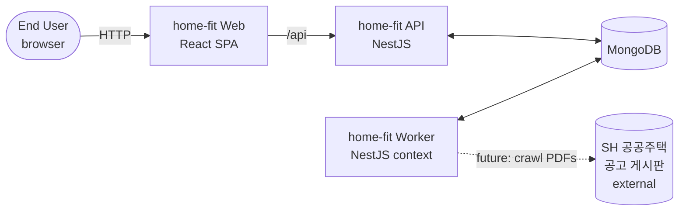

# Business Overview

## Business Context

## Business Description

- **Product** (per `docs/home-fit-spec.md`): home-fit is a web service that lets a user check, via short Q&A, whether they qualify for a SH (서울주택도시공사) public-housing announcement and what the cost would be — without reading the full PDF announcement themselves.
- **Current implementation state**: The repository today is a deployment-environment scaffold only. None of the product features (announcement crawling, PDF AI analysis, Q&A state machine, glossary, results) are implemented. The running services exist only to prove that React + NestJS + MongoDB + Nginx + Docker Compose deploy and talk to each other end-to-end.

## Business Transactions (target — from spec)

These are the business transactions the product is intended to support. Most are **not yet implemented**.

| # | Transaction | Status |
|---|---|---|
| BT-1 | Auto-collect SH announcements (periodic crawl) | Not implemented (worker scaffold only) |
| BT-2 | AI analysis of an announcement PDF into structured fields + Q&A state machine | Not implemented |
| BT-3 | Browse active announcements list | Not implemented |
| BT-4 | View announcement detail + Q&A state machine | Not implemented |
| BT-5 | Run Q&A flow and compute eligibility result | Not implemented |
| BT-6 | View glossary / contextual term tooltips | Not implemented |
| BT-7 | Manage user profile for question pre-fill | Not implemented |
| BT-OPS-1 | Service health check | Implemented (`GET /api/health`) |
| BT-OPS-2 | Manual trigger of worker job | Implemented (`POST /api/worker/trigger`) |
| BT-OPS-3 | Scheduled worker tick (every 60s, no real work yet) | Implemented (logs MongoDB state, writes a `WorkerJobRun` row) |

## Business Dictionary (from spec)

- **공고 (Announcement)**: A public-housing notice published by SH; PDF source.
- **임대 / 분양**: Rental / for-sale supply category.
- **장기전세 / 국민임대 / 행복주택 / 공공분양**: Housing types under SH.
- **일반공급 / 특별공급**: General supply vs. special supply tracks (e.g. newlyweds, youth, persons with disability).
- **자격 조건**: Eligibility (income limits, asset caps, residency).
- **Q&A 상태 머신**: Server-generated state machine driving the eligibility questionnaire.
- **결과 (적합 / 부적합 / 조건부)**: Eligibility outcome — qualified / not qualified / conditional.
- **용어 사전 (Glossary)**: AI-generated explanations of public-housing jargon.

## Component-Level Business Descriptions

### apps/web (React SPA)
- **Purpose**: User-facing UI; today renders only a "환경 세팅 준비됨" status screen with health-check info.
- **Responsibilities (today)**: Fetch `/api/health`, show service status badges.
- **Responsibilities (target)**: Announcement list, announcement detail, Q&A flow (flash-card style — current iteration scope), result screen, glossary.

### apps/api (NestJS HTTP)
- **Purpose**: HTTP edge for the SPA.
- **Responsibilities (today)**: Health endpoint, manual worker trigger endpoint, MongoDB connection.
- **Responsibilities (target)**: `GET /announcements`, `GET /announcements/{seq}` (returns Q&A state machine), `GET /glossary`.

### apps/api (Worker entry — `worker.ts` + `WorkerModule`)
- **Purpose**: Background crawling and analysis process.
- **Responsibilities (today)**: Boot a Nest application context, run a 60s interval job that logs Mongo state and persists a `WorkerJobRun` document.
- **Responsibilities (target)**: Periodic SH crawl, PDF analysis pipeline, populate `announcements` collection.

### infra/nginx
- **Purpose**: Single public ingress; serves SPA static assets and proxies `/api/` to the API container.
- **Responsibilities**: Static file serving, reverse proxy, asset caching.
