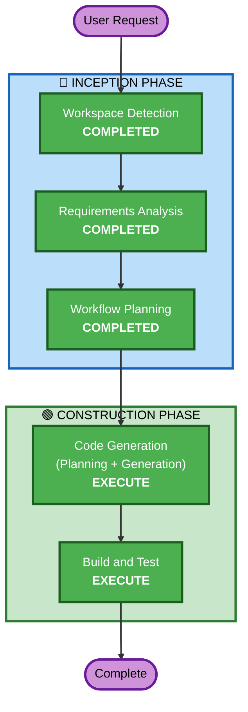

# Execution Plan - 컬러톤 변경

## Detailed Analysis Summary

### Transformation Scope
- **Transformation Type**: UI-only (컬러 시스템 변경)
- **Primary Changes**: CSS 컬러값 및 Tailwind 클래스 변경
- **Related Components**: StepIndicator, OnboardingForm, StepComplete, HomePage, AnnouncementsPage.css, QuestionsPage.css

### Change Impact Assessment
- **User-facing changes**: Yes - 전체 UI 컬러톤 변경
- **Structural changes**: No - 컴포넌트 구조 변경 없음
- **Data model changes**: No
- **API changes**: No
- **NFR impact**: No (접근성 대비율 확인 필요)

### Risk Assessment
- **Risk Level**: Low
- **Rollback Complexity**: Easy (git revert)
- **Testing Complexity**: Simple (시각적 확인 위주)

## Workflow Visualization



### Text Alternative
```
Phase 1: INCEPTION
- Stage 1: Workspace Detection (COMPLETED)
- Stage 2: Requirements Analysis (COMPLETED)
- Stage 3: Workflow Planning (COMPLETED)

Phase 2: CONSTRUCTION
- Stage 4: Code Generation (EXECUTE)
- Stage 5: Build and Test (EXECUTE)
```

## Phases to Execute

### 🔵 INCEPTION PHASE
- [x] Workspace Detection (COMPLETED)
- [x] Reverse Engineering - SKIP
  - **Rationale**: UI 컬러 변경만 수행, 기존 reverse engineering 불필요
- [x] Requirements Analysis (COMPLETED)
- [x] User Stories - SKIP
  - **Rationale**: 사용자 시나리오 변경 없음, 순수 UI 스타일링 작업
- [x] Workflow Planning (COMPLETED)
- [x] Application Design - SKIP
  - **Rationale**: 새로운 컴포넌트/서비스 없음, 기존 컴포넌트 내 컬러값만 변경
- [x] Units Generation - SKIP
  - **Rationale**: 단일 작업 단위, 분해 불필요

### 🟢 CONSTRUCTION PHASE
- [x] Functional Design - SKIP
  - **Rationale**: 비즈니스 로직 변경 없음
- [x] NFR Requirements - SKIP
  - **Rationale**: NFR 요구사항 없음 (접근성은 코드 생성 시 확인)
- [x] NFR Design - SKIP
  - **Rationale**: NFR Requirements 스킵됨
- [x] Infrastructure Design - SKIP
  - **Rationale**: 인프라 변경 없음
- [ ] Code Generation - EXECUTE (ALWAYS)
  - **Rationale**: 6개 파일의 컬러값 변경 구현
- [ ] Build and Test - EXECUTE (ALWAYS)
  - **Rationale**: 빌드 확인 및 시각적 검증

## Estimated Timeline
- **Total Stages to Execute**: 2 (Code Generation + Build and Test)
- **Estimated Duration**: 단일 세션 내 완료 가능

## Success Criteria
- **Primary Goal**: 전체 프로덕트 컬러톤을 오렌지/앰버 기반 따뜻한 톤으로 통일
- **Key Deliverables**: 6개 파일 컬러 변경 완료
- **Quality Gates**: 빌드 성공, WCAG AA 대비율 충족
