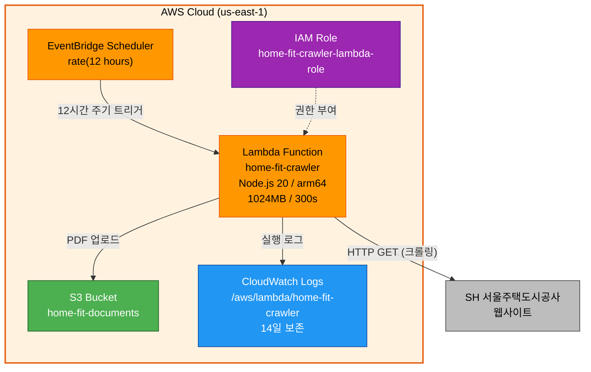

# Deployment Architecture - SH Crawler

## Architecture Diagram



### Text Alternative
```
EventBridge Scheduler (12시간)
    |
    v
Lambda Function (home-fit-crawler)
    |
    ├── HTTP GET → SH 웹사이트 (크롤링 + PDF 다운로드)
    ├── S3 PutObject → home-fit-documents 버킷 (PDF 저장)
    └── CloudWatch Logs (실행 로그)
```

---

## Execution Flow

```
1. EventBridge Scheduler 트리거 (12시간 주기)
       |
2. Lambda 함수 실행 시작
       |
3. SH 임대 게시판 크롤링 (HTTP GET)
   └── HTML 파싱 → 공고 목록 추출
       |
4. SH 분양 게시판 크롤링 (HTTP GET)
   └── HTML 파싱 → 공고 목록 추출
       |
5. S3 ListObjects로 기존 PDF 확인 (중복 감지)
       |
6. 신규 공고만 필터링
       |
7. 각 신규 공고의 PDF 다운로드 + S3 업로드
   └── announcements/{board_type}/{seq}/{filename}.pdf
       |
8. 실행 결과 로그 출력 (신규 N건 저장 완료)
       |
9. Lambda 함수 종료
```

---

## Deployment Process

### 인프라 배포 (1회)
```bash
cd aws-infra
terraform init
terraform plan
terraform apply
```

### Lambda 코드 배포 (수동)
1. Lambda 소스 코드 빌드 (esbuild로 번들링)
2. `dist/` 결과물을 zip으로 압축
3. AWS 콘솔 → Lambda → home-fit-crawler → "Upload from" → .zip file
4. 테스트 이벤트로 수동 실행 확인

---

## S3 Object Structure

```
home-fit-documents-{account_id}/
└── announcements/
    ├── rental/
    │   ├── 12345/
    │   │   └── 공고문.pdf
    │   └── 12346/
    │       ├── 공고문.pdf
    │       └── 첨부1.pdf
    └── sale/
        └── 12400/
            └── 분양공고.pdf
```

---

## Terraform File Changes

### 수정 파일: `aws-infra/main.tf`
- 기존 EC2 리소스 아래에 Lambda/S3/EventBridge 리소스 추가

### 수정 파일: `aws-infra/outputs.tf`
- S3 버킷 이름, Lambda 함수 ARN 출력 추가

### 수정 파일: `aws-infra/variables.tf`
- Lambda 관련 변수 추가 (필요시)

### 신규 파일 없음
- 기존 Terraform 구조에 리소스만 추가
