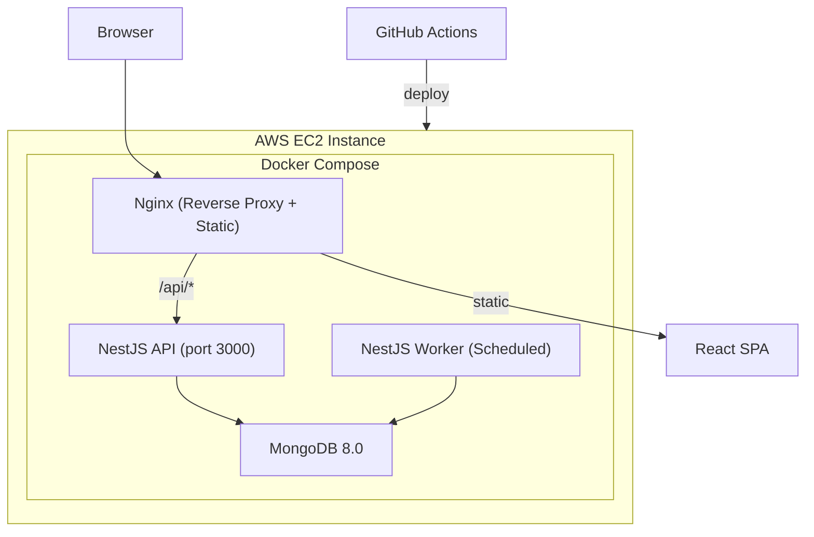
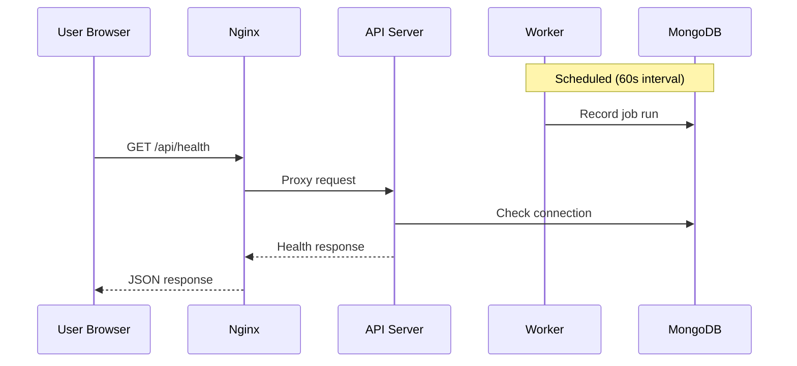

# System Architecture

## System Overview
home-fit-ai는 npm workspaces 기반 TypeScript 모노레포로, NestJS API 서버, NestJS Worker 프로세스, React SPA 프론트엔드로 구성됨. Docker Compose로 로컬 개발 및 프로덕션 배포를 관리하며, AWS EC2에 배포됨.

## Architecture Diagram

## Component Descriptions

### apps/api (API Server + Worker)
- **Purpose**: 백엔드 서비스 (HTTP API + 백그라운드 Worker)
- **Responsibilities**: REST API 제공, 스케줄 기반 작업 실행, MongoDB CRUD
- **Dependencies**: NestJS, Mongoose, @nestjs/schedule
- **Type**: Application

### apps/web (Web Frontend)
- **Purpose**: 사용자 인터페이스
- **Responsibilities**: SPA 라우팅, API 호출, 프로필 관리 (로컬 스토리지)
- **Dependencies**: React, React Router, Vite
- **Type**: Application

### infra/nginx
- **Purpose**: 리버스 프록시 및 정적 파일 서빙
- **Responsibilities**: API 프록시, SPA 빌드 결과물 서빙, 캐시 헤더
- **Dependencies**: Nginx
- **Type**: Infrastructure

### aws-infra (Terraform)
- **Purpose**: AWS 인프라 프로비저닝
- **Responsibilities**: EC2 인스턴스, 보안 그룹, SSH 키 페어
- **Dependencies**: Terraform, AWS Provider
- **Type**: Infrastructure

## Data Flow

## Integration Points
- **External APIs**: SH 서울주택도시공사 웹사이트 (크롤링 대상, 미구현)
- **Databases**: MongoDB 8.0 (worker_job_runs collection)
- **Third-party Services**: GitHub Container Registry (이미지 저장소)

## Infrastructure Components
- **Terraform**: EC2 인스턴스 (Amazon Linux 2023), Security Group (SSH/HTTP/HTTPS)
- **Deployment Model**: GitHub Actions → GHCR → EC2 Docker Compose
- **Networking**: Default VPC, Public subnet, Security Group (22/80/443)
