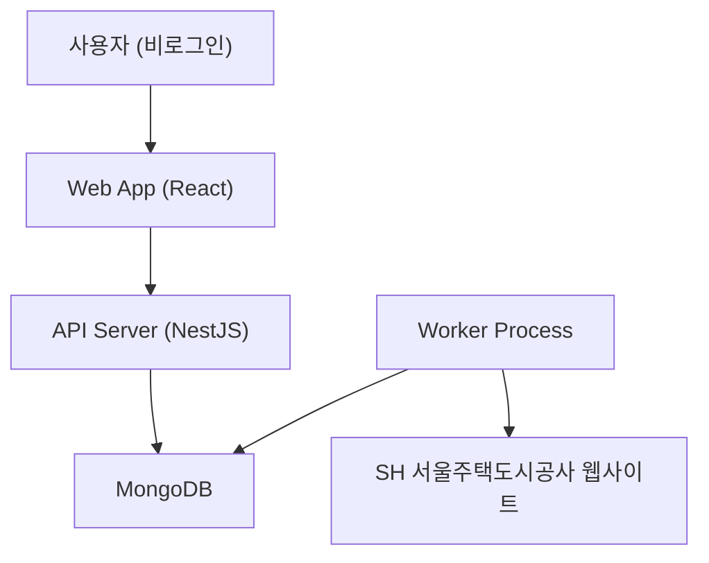

# Business Overview

## Business Context Diagram

## Business Description
- **Business Description**: home-fit-ai는 SH 서울주택도시공사의 임대/분양 공고문(PDF)을 AI가 자동 분석하여, 사용자가 간단한 Q&A만으로 공공주택 신청 자격과 필요 금액을 확인할 수 있는 웹 서비스
- **Business Transactions**:
  1. 공고 자동 수집 - SH 게시판 크롤링으로 새 공고 감지 및 PDF 분석 파이프라인 트리거
  2. 사용자 온보딩 - 기본정보(거주지, 가구원수, 무주택여부, 소득, 자산) 수집 및 로컬 저장
  3. Q&A 자격 확인 - 상태 머신 기반 질문으로 자격 판단
  4. 결과 안내 - 적합/부적합/조건부 결과 및 비용 정보 제공
- **Business Dictionary**:
  - 장기전세: 전세보증금만으로 입주하는 공공임대주택
  - 국민임대: 보증금 + 월 임대료 방식의 공공임대주택
  - 행복주택: 청년/신혼부부 대상 공공임대주택
  - 공공분양: 시세보다 저렴한 가격으로 분양하는 공공주택
  - 특별공급: 신혼부부/청년/장애인 등 특정 자격자 대상 우선 공급

## Component Level Business Descriptions

### apps/api (API Server)
- **Purpose**: 공고 데이터 제공 및 Worker 작업 관리를 위한 백엔드 서버
- **Responsibilities**: Health check, Worker job 트리거/기록, 데이터베이스 연결 관리

### apps/api (Worker Process)
- **Purpose**: 주기적 크롤링 및 분석 작업을 수행하는 백그라운드 프로세스
- **Responsibilities**: 스케줄 기반 작업 실행, 작업 결과 MongoDB 기록

### apps/web (Web Frontend)
- **Purpose**: 사용자 인터페이스 제공
- **Responsibilities**: 서비스 상태 표시, 온보딩 페이지, 공고 목록/Q&A (미구현)
