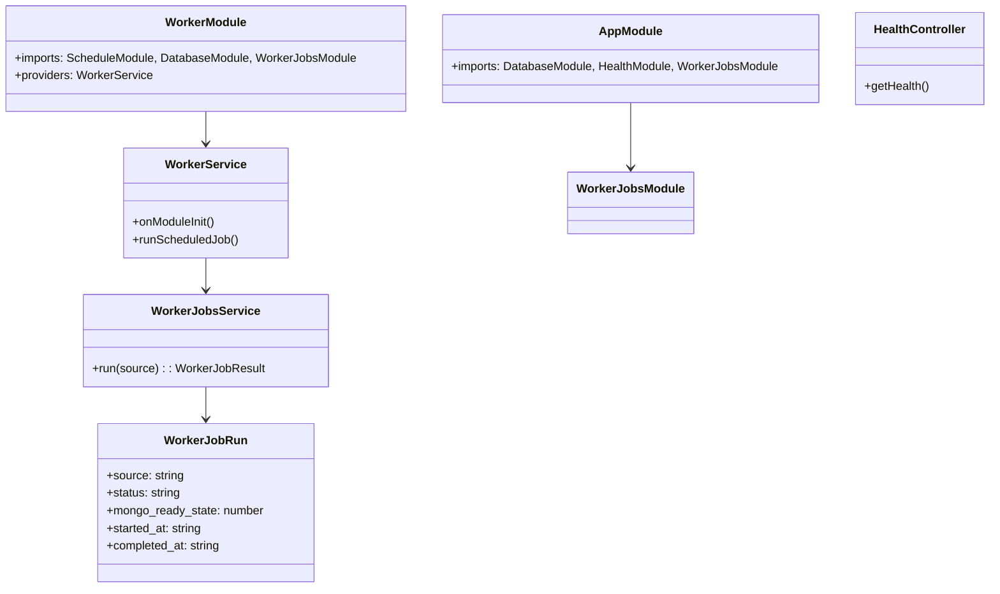

# Code Structure

## Build System
- **Type**: npm workspaces (monorepo)
- **Configuration**: Root package.json with `"workspaces": ["apps/*"]`
- **API Build**: NestJS CLI (`nest build`)
- **Web Build**: Vite + TypeScript (`tsc -b && vite build`)

## Key Classes/Modules

### Existing Files Inventory

**apps/api/src/**
- `main.ts` - API 서버 부트스트랩 (port 3000, CORS, /api prefix)
- `worker.ts` - Worker 프로세스 부트스트랩 (ApplicationContext)
- `app.module.ts` - API 루트 모듈 (Config, Database, Health, WorkerJobs)
- `database/database.module.ts` - Mongoose 연결 설정 (MONGO_URI)
- `health/health.controller.ts` - GET /api/health 엔드포인트
- `health/health.module.ts` - Health 모듈
- `worker/worker.module.ts` - Worker 루트 모듈 (Schedule, Database, WorkerJobs)
- `worker/worker.service.ts` - 60초 간격 스케줄 작업 실행
- `worker-jobs/worker-jobs.module.ts` - WorkerJobs 모듈 (Schema, Service, Controller)
- `worker-jobs/worker-jobs.service.ts` - 작업 실행 및 MongoDB 기록
- `worker-jobs/worker-job-run.schema.ts` - Mongoose 스키마 (source, status, timestamps)
- `worker-jobs/worker-trigger.controller.ts` - POST /api/worker/trigger 수동 트리거

**apps/web/src/**
- `main.tsx` - React 앱 엔트리포인트
- `App.tsx` - 라우터 설정 (/, /onboarding)
- `pages/HomePage.tsx` - 서비스 상태 대시보드
- `pages/OnboardingPage.tsx` - 프로필 입력 페이지 (스켈레톤)
- `styles.css` - 글로벌 스타일
- `vite-env.d.ts` - Vite 타입 선언

**infra/**
- `nginx/default.conf` - 개발용 Nginx 설정
- `nginx/default.prod.conf` - 프로덕션 Nginx 설정
- `nginx/Dockerfile` - Nginx 이미지 빌드 (Vite 빌드 포함)

**aws-infra/**
- `main.tf` - EC2, Security Group, Key Pair
- `variables.tf` - 변수 정의
- `outputs.tf` - 출력 정의
- `providers.tf` - AWS Provider 설정
- `user-data.sh` - EC2 초기화 스크립트

## Design Patterns

### Module Pattern (NestJS)
- **Location**: 모든 API 모듈
- **Purpose**: 의존성 주입 및 모듈 격리
- **Implementation**: @Module 데코레이터, imports/exports/providers

### Separate Worker Process
- **Location**: `worker.ts`, `worker/worker.module.ts`
- **Purpose**: API 서버와 분리된 백그라운드 작업 실행
- **Implementation**: NestJS ApplicationContext (HTTP 없이), @Interval 스케줄러

### Schema-First Database
- **Location**: `worker-jobs/worker-job-run.schema.ts`
- **Purpose**: MongoDB 스키마 정의 및 타입 안전성
- **Implementation**: @nestjs/mongoose SchemaFactory

## Critical Dependencies

### @nestjs/mongoose (^10.0.6)
- **Usage**: MongoDB 연결 및 스키마 관리
- **Purpose**: Mongoose ODM을 NestJS DI 시스템과 통합

### @nestjs/schedule (^4.0.2)
- **Usage**: Worker 프로세스의 주기적 작업 실행
- **Purpose**: @Interval 데코레이터로 60초 간격 작업 스케줄링
