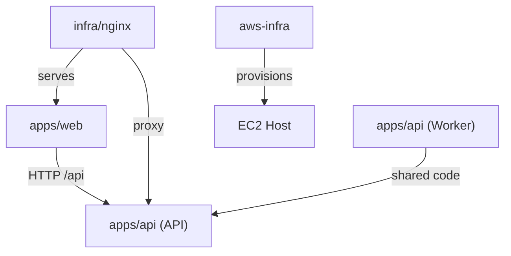

# Dependencies

## Internal Dependencies

### apps/web depends on apps/api
- **Type**: Runtime (HTTP)
- **Reason**: API 호출로 데이터 조회 (health, 공고 등)

### Worker depends on API shared modules
- **Type**: Compile (same package)
- **Reason**: DatabaseModule, WorkerJobsModule 공유

### infra/nginx depends on apps/web
- **Type**: Build (Dockerfile multi-stage)
- **Reason**: Vite 빌드 결과물을 Nginx 이미지에 포함

## External Dependencies

### @nestjs/common (^10.3.8)
- **Version**: 10.x
- **Purpose**: NestJS 핵심 데코레이터 및 유틸리티
- **License**: MIT

### @nestjs/mongoose (^10.0.6)
- **Version**: 10.x
- **Purpose**: Mongoose ODM NestJS 통합
- **License**: MIT

### @nestjs/schedule (^4.0.2)
- **Version**: 4.x
- **Purpose**: Cron/Interval 기반 스케줄링
- **License**: MIT

### mongoose (^8.4.0)
- **Version**: 8.x
- **Purpose**: MongoDB ODM
- **License**: MIT

### react (^18.3.1)
- **Version**: 18.x
- **Purpose**: UI 라이브러리
- **License**: MIT

### react-router-dom (^7.15.1)
- **Version**: 7.x
- **Purpose**: 클라이언트 사이드 라우팅
- **License**: MIT

### vite (^7.0.0)
- **Version**: 7.x
- **Purpose**: 프론트엔드 빌드 도구 및 개발 서버
- **License**: MIT
