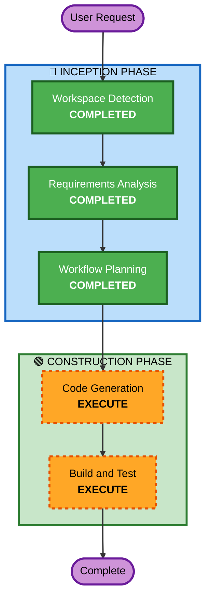

# Execution Plan - 용어집 퀴즈 페이지

## Detailed Analysis Summary

### Change Impact Assessment
- **User-facing changes**: Yes - 새로운 `/glossary` 페이지 추가
- **Structural changes**: No - 기존 아키텍처 내 페이지 추가
- **Data model changes**: No - 기존 glossary 스키마 그대로 사용
- **API changes**: No - 기존 `GET /api/glossary` 그대로 활용
- **NFR impact**: No - 단순 프론트엔드 페이지 추가

### Risk Assessment
- **Risk Level**: Low
- **Rollback Complexity**: Easy (단일 페이지 추가, 라우트 제거로 롤백)
- **Testing Complexity**: Simple (UI 동작 확인)

## Workflow Visualization



### Text Alternative
```
Phase 1: INCEPTION
- Workspace Detection (COMPLETED)
- Requirements Analysis (COMPLETED)
- Workflow Planning (COMPLETED)

Phase 2: CONSTRUCTION
- Code Generation (EXECUTE)
- Build and Test (EXECUTE)
```

## Phases to Execute

### 🔵 INCEPTION PHASE
- [x] Workspace Detection (COMPLETED)
- [x] Requirements Analysis (COMPLETED)
- [x] Workflow Planning (COMPLETED)
- [x] Reverse Engineering - SKIP
  - **Rationale**: 기존 glossary API 구조 이미 파악 완료
- [x] User Stories - SKIP
  - **Rationale**: 단일 사용자 시나리오, 요구사항으로 충분
- [x] Application Design - SKIP
  - **Rationale**: 기존 컴포넌트 구조 내 페이지 추가, 새 서비스 불필요
- [x] Units Generation - SKIP
  - **Rationale**: 단일 유닛 (프론트엔드 페이지 1개)

### 🟢 CONSTRUCTION PHASE
- [x] Functional Design - SKIP
  - **Rationale**: 비즈니스 로직 단순 (랜덤 선택 + 보기 생성), 요구사항으로 충분
- [x] NFR Requirements - SKIP
  - **Rationale**: 기존 NFR 설정 충분, 새로운 NFR 요구 없음
- [x] NFR Design - SKIP
  - **Rationale**: NFR Requirements 스킵에 따라 자동 스킵
- [x] Infrastructure Design - SKIP
  - **Rationale**: 인프라 변경 없음 (프론트엔드 단독)
- [ ] Code Generation - EXECUTE (ALWAYS)
  - **Rationale**: GlossaryPage 컴포넌트 + 라우트 추가 구현 필요
- [ ] Build and Test - EXECUTE (ALWAYS)
  - **Rationale**: 빌드 확인 및 동작 테스트 필요

## Estimated Timeline
- **Total Stages to Execute**: 2 (Code Generation, Build and Test)
- **Estimated Duration**: 빠른 구현 가능 (단일 페이지)

## Success Criteria
- **Primary Goal**: `/glossary` 페이지에서 랜덤 2문제 퀴즈 동작
- **Key Deliverables**:
  - `GlossaryPage.tsx` 컴포넌트
  - `App.tsx` 라우트 추가
- **Quality Gates**:
  - TypeScript 빌드 성공
  - 퀴즈 정답/오답 피드백 정상 동작
  - 새 퀴즈 재생성 동작
  - 모바일 반응형 확인
