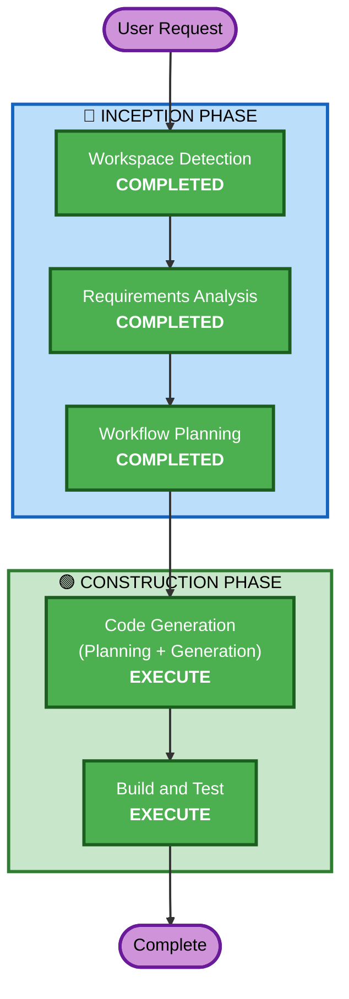

# Execution Plan — Home 페이지

## Detailed Analysis Summary

### Transformation Scope
- **Transformation Type**: Single component enhancement + 신규 공통 컴포넌트 추가
- **Primary Changes**: HomePage 교체, GNB 신규 생성, 라우팅 수정
- **Related Components**: App.tsx, HomePage.tsx, 신규 GNB.tsx, 신규 StatusPage.tsx

### Change Impact Assessment
- **User-facing changes**: Yes — 전체 네비게이션 UX 변경 + Home 페이지 완전 교체
- **Structural changes**: Yes — App 레벨에 GNB 레이아웃 추가
- **Data model changes**: No — 기존 UserProfile 구조 그대로 활용
- **API changes**: No — 프론트엔드 UI 변경만
- **NFR impact**: No — 기존 성능/보안 수준 유지

### Risk Assessment
- **Risk Level**: Low
- **Rollback Complexity**: Easy (UI 변경만, 데이터 영향 없음)
- **Testing Complexity**: Simple (시각적 확인 + 프로필 상태 로직 검증)

## Workflow Visualization

## Phases to Execute

### 🔵 INCEPTION PHASE
- [x] Workspace Detection (COMPLETED)
- [x] Requirements Analysis (COMPLETED)
- [x] Workflow Planning (COMPLETED)
- ~~Reverse Engineering~~ — SKIP: 기존 코드 구조 이미 파악됨
- ~~User Stories~~ — SKIP: UI 중심 단순 기능, 단일 사용자 유형
- ~~Application Design~~ — SKIP: 기존 컴포넌트 구조 내에서 변경, 새 서비스 레이어 불필요
- ~~Units Generation~~ — SKIP: 단일 유닛 (Home 페이지 + GNB)

### 🟢 CONSTRUCTION PHASE
- ~~Functional Design~~ — SKIP: 비즈니스 로직 없음, UI 렌더링 + 로컬 스토리지 읽기만
- ~~NFR Requirements~~ — SKIP: 기존 NFR 설정 충분, 새 요구사항 없음
- ~~NFR Design~~ — SKIP: NFR Requirements 스킵됨
- ~~Infrastructure Design~~ — SKIP: 인프라 변경 없음 (프론트엔드 UI만)
- [ ] **Code Generation** — EXECUTE (ALWAYS)
  - **Rationale**: 새 컴포넌트 구현 필요 (GNB, HomePage, StatusPage, SVG 일러스트, 프로필 유틸)
- [ ] **Build and Test** — EXECUTE (ALWAYS)
  - **Rationale**: 빌드 검증 및 동작 확인 필요

## Success Criteria
- **Primary Goal**: 사용자가 Home 페이지에서 서비스 가치를 즉시 이해하고, GNB를 통해 주요 기능에 접근 가능
- **Key Deliverables**:
  - 새 Intro HomePage 컴포넌트
  - 전역 GNB 컴포넌트 (프로필 상태 연동)
  - SVG 일러스트레이션 컴포넌트
  - 프로필 완성 여부 유틸리티
  - 기존 Health Check → StatusPage 분리
- **Quality Gates**:
  - TypeScript 빌드 성공
  - 모든 라우트 정상 동작
  - GNB 프로필 상태 전환 정상 동작
  - 반응형 레이아웃 확인
