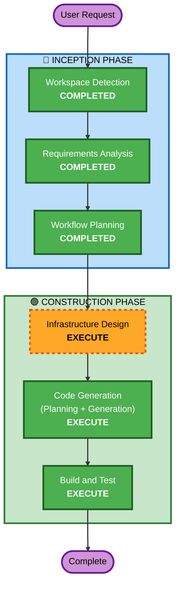

# Execution Plan

## Detailed Analysis Summary

### Transformation Scope
- **Transformation Type**: Infrastructure addition (새로운 AWS 서비스 추가)
- **Primary Changes**: S3, Lambda, Bedrock, DocumentDB 인프라 리소스 추가
- **Related Components**: 기존 EC2 인스턴스 (네트워크 연결), VPC 설정

### Change Impact Assessment
- **User-facing changes**: No — 인프라 레이어만 변경, 애플리케이션 코드는 별도
- **Structural changes**: Yes — 새로운 AWS 서비스 추가 (S3, Lambda, DocumentDB, Bedrock IAM)
- **Data model changes**: No — 데이터 모델은 이미 spec에 정의됨, 인프라만 구축
- **API changes**: No — API 엔드포인트는 기존 EC2에서 서빙, 인프라만 추가
- **NFR impact**: Yes — VPC 네트워킹, IAM 권한, 보안 그룹 설정 필요

### Component Relationships
```
## Component Relationships
- **Primary Component**: aws-infra/ (Terraform)
- **Infrastructure Components**: S3, Lambda, DocumentDB, Bedrock IAM, VPC Networking
- **Shared Components**: VPC, Security Groups (기존 EC2와 공유)
- **Dependent Components**: EC2 API 서버 (DocumentDB 접근 필요)
- **Supporting Components**: IAM Roles, VPC Endpoints
```

### Risk Assessment
- **Risk Level**: Medium
- **Rollback Complexity**: Easy (Terraform destroy로 새 리소스만 제거 가능)
- **Testing Complexity**: Moderate (AWS 서비스 간 연동 테스트 필요)

---

## Workflow Visualization



---

## Phases to Execute

### 🔵 INCEPTION PHASE
- [x] Workspace Detection (COMPLETED)
- [x] Reverse Engineering (SKIPPED — 인프라 추가 범위, 기존 코드 분석 불필요)
- [x] Requirements Analysis (COMPLETED)
- [x] User Stories (SKIPPED — 인프라 변경만, 사용자 시나리오 영향 없음)
- [x] Workflow Planning (COMPLETED)
- [x] Application Design (SKIPPED — 새 컴포넌트/서비스 설계 불필요, 인프라만 추가)
- [x] Units Generation (SKIPPED — 단일 유닛, 분해 불필요)

### 🟢 CONSTRUCTION PHASE
- [ ] Functional Design (SKIP)
  - **Rationale**: 비즈니스 로직 설계 불필요, 인프라 리소스 정의만 필요
- [ ] NFR Requirements (SKIP)
  - **Rationale**: Security extension 비활성화, 인프라 기본 설정으로 충분
- [ ] NFR Design (SKIP)
  - **Rationale**: NFR Requirements 스킵됨
- [ ] Infrastructure Design - **EXECUTE**
  - **Rationale**: S3, Lambda, DocumentDB, Bedrock IAM, VPC 네트워킹 설계 필요
- [ ] Code Generation - **EXECUTE** (ALWAYS)
  - **Rationale**: Terraform 코드 생성 (aws-infra/ 폴더)
- [ ] Build and Test - **EXECUTE** (ALWAYS)
  - **Rationale**: terraform plan/apply 검증 절차

### 🟡 OPERATIONS PHASE
- [ ] Operations - PLACEHOLDER

---

## Success Criteria
- **Primary Goal**: PDF 분석 파이프라인을 위한 AWS 인프라 완성
- **Key Deliverables**:
  - S3 버킷 + 이벤트 알림 설정
  - Lambda 함수 인프라 (IAM Role, VPC 설정)
  - DocumentDB 클러스터 + 보안 그룹
  - Bedrock 모델 접근 IAM 정책
  - VPC 네트워킹 (Lambda ↔ DocumentDB ↔ EC2)
- **Quality Gates**:
  - `terraform plan` 성공
  - 리소스 간 네트워크 연결 확인
  - IAM 권한 최소 권한 원칙 준수
