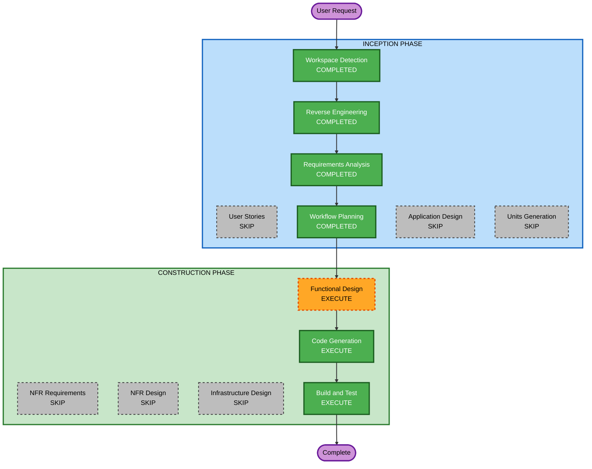

# Execution Plan

## Detailed Analysis Summary

### Transformation Scope
- **Transformation Type**: Single component enhancement (Worker process)
- **Primary Changes**: 기존 Worker의 placeholder 로직을 실제 크롤링 로직으로 교체
- **Related Components**: Worker Service, Worker Jobs, 새 Crawler Module, Announcement Schema

### Change Impact Assessment
- **User-facing changes**: No — 백엔드 Worker 프로세스 변경만
- **Structural changes**: Yes — 새 모듈(Crawler) 추가, 기존 Worker 스케줄 변경
- **Data model changes**: Yes — Announcement, CrawlRun 스키마 추가
- **API changes**: No — 기존 POST /api/worker/trigger 유지
- **NFR impact**: No — 기존 NFR 설정 충분

### Component Relationships
- **Primary Component**: `apps/api/src/worker/` (Worker Service)
- **New Components**: `apps/api/src/crawler/` (Crawler Module)
- **Modified Components**: `apps/api/src/worker-jobs/` (WorkerJobsService 확장)
- **Unchanged Components**: `apps/web/`, `infra/nginx/`, Health Module

### Risk Assessment
- **Risk Level**: Low-Medium
- **Rollback Complexity**: Easy (새 모듈 추가 위주, 기존 코드 최소 변경)
- **Testing Complexity**: Moderate (외부 웹사이트 의존, mock 필요)

## Workflow Visualization



### Text Alternative
```
Phase 1: INCEPTION
- Workspace Detection (COMPLETED)
- Reverse Engineering (COMPLETED)
- Requirements Analysis (COMPLETED)
- User Stories (SKIP)
- Workflow Planning (COMPLETED)
- Application Design (SKIP)
- Units Generation (SKIP)

Phase 2: CONSTRUCTION
- Functional Design (EXECUTE)
- NFR Requirements (SKIP)
- NFR Design (SKIP)
- Infrastructure Design (SKIP)
- Code Generation (EXECUTE)
- Build and Test (EXECUTE)
```

## Phases to Execute

### INCEPTION PHASE
- [x] Workspace Detection (COMPLETED)
- [x] Reverse Engineering (COMPLETED)
- [x] Requirements Analysis (COMPLETED)
- [x] User Stories - SKIP
  - **Rationale**: 백엔드 전용 기능, 사용자 인터랙션 없음, 단일 개발자
- [x] Workflow Planning (COMPLETED)
- [x] Application Design - SKIP
  - **Rationale**: 기존 NestJS 모듈 패턴 따르면 됨, 새 컴포넌트 설계가 단순
- [x] Units Generation - SKIP
  - **Rationale**: 단일 유닛(크롤러 모듈)으로 충분, 분해 불필요

### CONSTRUCTION PHASE
- [ ] Functional Design - EXECUTE
  - **Rationale**: 크롤링 비즈니스 로직, 상태 머신, 데이터 모델 설계 필요
- [ ] NFR Requirements - SKIP
  - **Rationale**: POC 레벨, 기존 인프라 충분, 별도 NFR 불필요
- [ ] NFR Design - SKIP
  - **Rationale**: NFR Requirements 스킵으로 인해 자동 스킵
- [ ] Infrastructure Design - SKIP
  - **Rationale**: 기존 Docker Compose + MongoDB 인프라 그대로 사용
- [ ] Code Generation - EXECUTE (ALWAYS)
  - **Rationale**: 크롤러 모듈 구현, 스키마 생성, Worker 통합
- [ ] Build and Test - EXECUTE (ALWAYS)
  - **Rationale**: 빌드 검증 및 테스트 지침 생성

### OPERATIONS PHASE
- [ ] Operations - PLACEHOLDER

## Estimated Timeline
- **Total Stages to Execute**: 3 (Functional Design + Code Generation + Build and Test)
- **Estimated Duration**: 1 session

## Success Criteria
- **Primary Goal**: SH 분양 게시판에서 공고를 자동 수집하고 DB에 저장
- **Key Deliverables**:
  - Crawler Module (NestJS)
  - Announcement Mongoose Schema
  - CrawlRun Schema (실행 이력)
  - Worker Service 통합 (12시간 스케줄)
  - PDF URL 추출 및 분석 파이프라인 트리거
- **Quality Gates**:
  - TypeScript 빌드 성공
  - ESLint 통과
  - 크롤링 로직 단위 테스트
