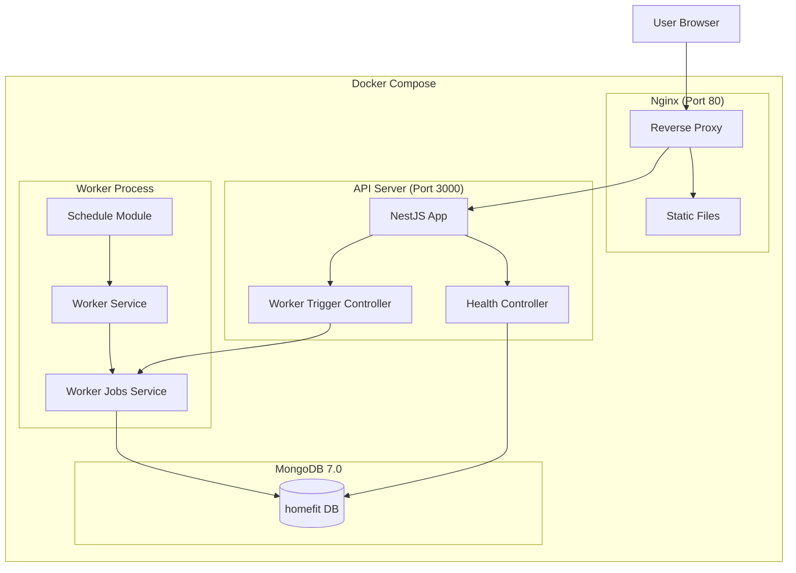
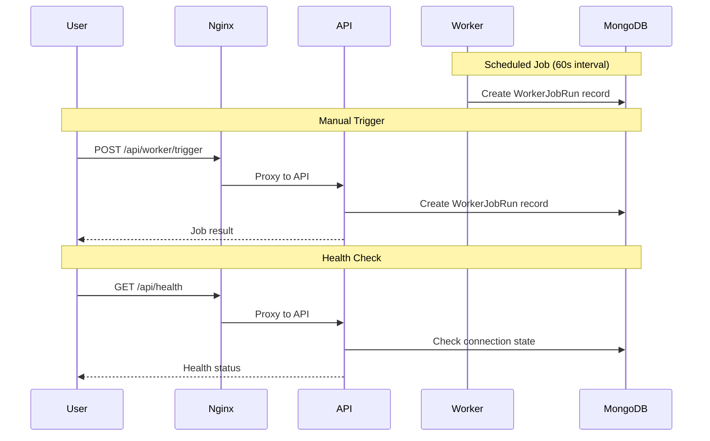

# System Architecture

## System Overview

Home Fit AI는 npm workspaces 기반 모노레포로 구성된 풀스택 웹 애플리케이션입니다. NestJS API 서버, 별도 Worker 프로세스, React 프론트엔드, MongoDB 데이터베이스, Nginx 리버스 프록시로 구성됩니다.

## Architecture Diagram

## Component Descriptions

### apps/api (NestJS API + Worker)
- **Purpose**: Backend API 서버 및 백그라운드 Worker
- **Responsibilities**: REST API 제공, 스케줄링, DB 연결
- **Dependencies**: MongoDB, @nestjs/mongoose, @nestjs/schedule
- **Type**: Application

### apps/web (React SPA)
- **Purpose**: 프론트엔드 웹 애플리케이션
- **Responsibilities**: UI 렌더링, API 호출
- **Dependencies**: React, Vite
- **Type**: Application

### infra/nginx
- **Purpose**: 리버스 프록시 및 정적 파일 서빙
- **Responsibilities**: API 라우팅 (/api/), SPA 서빙, 캐시 헤더
- **Dependencies**: Nginx 1.27
- **Type**: Infrastructure

## Data Flow

## Integration Points

- **External APIs**: SH 서울주택도시공사 웹사이트 (크롤링 대상, 아직 미구현)
- **Databases**: MongoDB 7.0 (worker_job_runs 컬렉션)
- **Third-party Services**: GitHub Container Registry (GHCR) for Docker images

## Infrastructure Components

- **Docker Compose**: 로컬 개발 및 프로덕션 배포
- **Deployment Model**: EC2 단일 인스턴스, GitHub Actions CI/CD
- **Networking**: Nginx 리버스 프록시, 내부 Docker 네트워크
