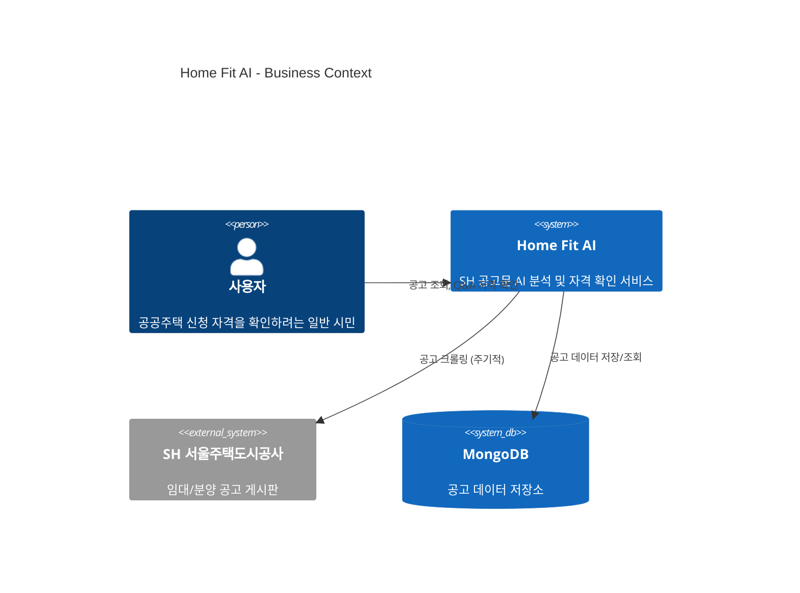

# Business Overview

## Business Context Diagram

## Business Description

- **Business Description**: SH 서울주택도시공사의 임대/분양 공고문(PDF)을 AI가 자동 분석하여, 사용자가 간단한 Q&A만으로 자신의 공공주택 신청 자격과 필요 금액을 확인할 수 있는 웹 서비스
- **Business Transactions**:
  1. **공고 자동 수집**: Worker가 SH 게시판을 주기적으로 크롤링하여 새 공고를 감지하고 PDF 분석 파이프라인을 트리거
  2. **공고 목록 조회**: 사용자가 활성 공고 목록을 조회 (프로필 기반 사전 필터링 적용)
  3. **Q&A 자격 확인**: 사용자가 공고를 선택하고 Q&A를 통해 자격 여부를 확인
  4. **결과 안내**: 적합/부적합/조건부 결과와 비용 정보 제공
- **Business Dictionary**:
  - **장기전세**: 전세보증금만으로 거주하는 공공임대 유형
  - **국민임대**: 보증금 + 월 임대료 방식의 공공임대 유형
  - **행복주택**: 청년/신혼부부 등을 위한 공공임대 유형
  - **공공분양**: 시세보다 저렴한 가격으로 분양하는 공공주택
  - **특별공급**: 신혼부부/청년/장애인 등 특정 조건 대상 우선 공급

## Component Level Business Descriptions

### apps/api (API Server)
- **Purpose**: 공고 데이터 제공 및 헬스체크 API 서버
- **Responsibilities**: REST API 제공, MongoDB 연결 관리, Worker 수동 트리거

### apps/api (Worker Process)
- **Purpose**: 백그라운드 작업 실행 (크롤링, 분석 등)
- **Responsibilities**: 주기적 스케줄링(60초), Worker Job 실행 및 기록

### apps/web (Web Frontend)
- **Purpose**: 사용자 인터페이스 제공
- **Responsibilities**: 서비스 상태 표시 (현재 최소 구현 상태)
