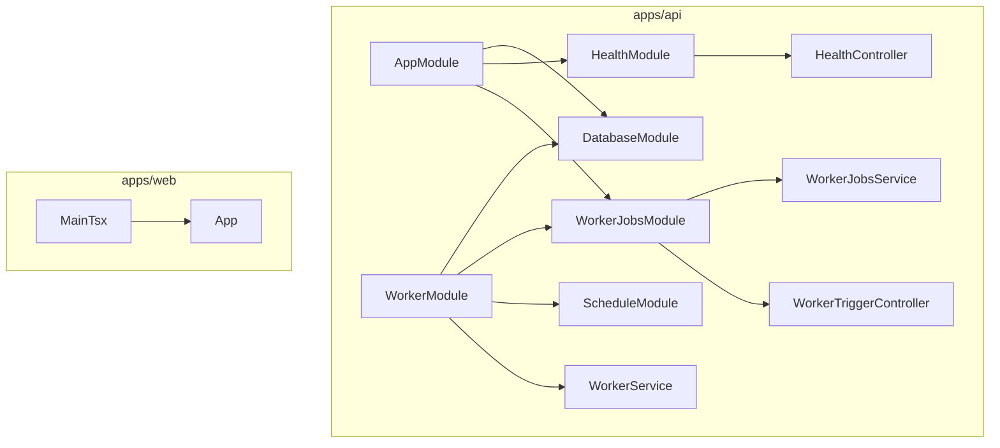

# Code Structure

## Build System
- **Type**: npm workspaces (monorepo)
- **Configuration**: Root `package.json` with `"workspaces": ["apps/*"]`
- **API Build**: NestJS CLI (`nest build`)
- **Web Build**: Vite + TypeScript (`tsc -b && vite build`)

## Key Classes/Modules

### Existing Files Inventory

**apps/api/src/**
- `main.ts` - API 서버 부트스트랩 (포트 3000, CORS 활성화, /api 프리픽스)
- `worker.ts` - Worker 프로세스 부트스트랩 (ApplicationContext)
- `app.module.ts` - API 루트 모듈 (Config, Database, Health, WorkerJobs)
- `database/database.module.ts` - MongoDB 연결 모듈 (MONGO_URI 환경변수)
- `health/health.controller.ts` - GET /api/health 엔드포인트
- `health/health.module.ts` - Health 모듈
- `worker/worker.module.ts` - Worker 루트 모듈 (Schedule, Database, WorkerJobs)
- `worker/worker.service.ts` - 60초 간격 스케줄링, MongoDB 상태 로깅
- `worker-jobs/worker-job-run.schema.ts` - Mongoose 스키마 (WorkerJobRun)
- `worker-jobs/worker-jobs.module.ts` - WorkerJobs 모듈
- `worker-jobs/worker-jobs.service.ts` - Job 실행 및 DB 기록 서비스
- `worker-jobs/worker-trigger.controller.ts` - POST /api/worker/trigger 엔드포인트

**apps/web/src/**
- `main.tsx` - React 앱 엔트리포인트
- `App.tsx` - 메인 컴포넌트 (헬스체크 상태 표시)
- `styles.css` - 글로벌 스타일
- `vite-env.d.ts` - Vite 타입 선언

**infra/nginx/**
- `Dockerfile` - Nginx 이미지 빌드 (웹 빌드 포함)
- `default.conf` - 개발용 Nginx 설정
- `default.prod.conf` - 프로덕션 Nginx 설정

## Design Patterns

### Module Pattern (NestJS)
- **Location**: 모든 API 모듈
- **Purpose**: 의존성 주입 및 모듈 격리
- **Implementation**: @Module 데코레이터, imports/providers/exports

### Separate Worker Process
- **Location**: `worker.ts`, `worker/worker.module.ts`
- **Purpose**: API 서버와 백그라운드 작업 분리
- **Implementation**: 동일 코드베이스, 별도 엔트리포인트, Docker 서비스 분리

### Schema-First (Mongoose)
- **Location**: `worker-jobs/worker-job-run.schema.ts`
- **Purpose**: MongoDB 문서 구조 정의
- **Implementation**: @Schema, @Prop 데코레이터, SchemaFactory

## Critical Dependencies

### @nestjs/mongoose (^10.0.6)
- **Usage**: MongoDB ODM 연결 및 모델 관리
- **Purpose**: Mongoose를 NestJS DI 시스템에 통합

### @nestjs/schedule (^4.0.2)
- **Usage**: Worker 프로세스의 주기적 작업 스케줄링
- **Purpose**: @Interval 데코레이터로 60초 간격 실행

### mongoose (^8.4.0)
- **Usage**: MongoDB 드라이버 및 ODM
- **Purpose**: 데이터 모델링, 쿼리, 연결 관리
