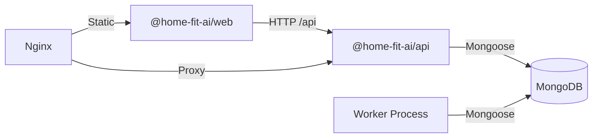

# Dependencies

## Internal Dependencies

### Worker depends on API codebase
- **Type**: Compile (same package, different entrypoint)
- **Reason**: Worker uses WorkerJobsModule and DatabaseModule from the API package

### Web depends on API
- **Type**: Runtime (HTTP)
- **Reason**: Frontend calls /api/health endpoint

## External Dependencies

### @nestjs/common (^10.3.8)
- **Purpose**: NestJS 핵심 데코레이터 및 유틸리티
- **License**: MIT

### @nestjs/mongoose (^10.0.6)
- **Purpose**: Mongoose를 NestJS DI에 통합
- **License**: MIT

### @nestjs/schedule (^4.0.2)
- **Purpose**: Cron/Interval 기반 스케줄링
- **License**: MIT

### mongoose (^8.4.0)
- **Purpose**: MongoDB ODM
- **License**: MIT

### react (^18.3.1)
- **Purpose**: UI 컴포넌트 라이브러리
- **License**: MIT

### vite (^5.2.11)
- **Purpose**: 프론트엔드 빌드 및 개발 서버
- **License**: MIT
