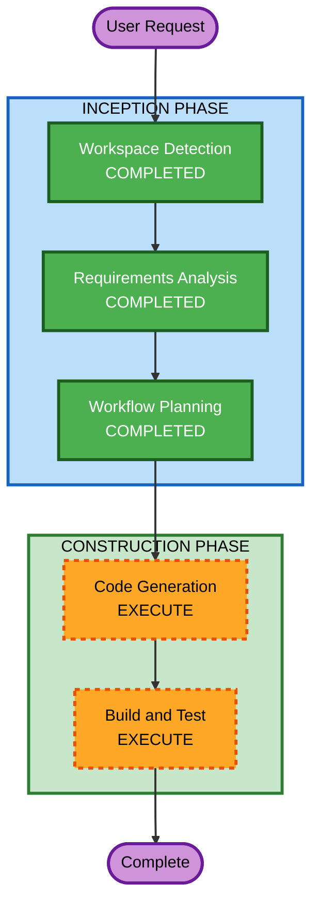

# Execution Plan - Question Info Feature

## Detailed Analysis Summary

### Transformation Scope
- **Transformation Type**: Single component enhancement + cross-cutting utility
- **Primary Changes**: QuestionsPage UI 레이아웃 변경, 숫자 포맷 유틸리티 추가
- **Related Components**: QuestionsPage, OnboardingPage, MyProfilePage, 공통 유틸리티

### Change Impact Assessment
- **User-facing changes**: Yes — 사이드 패널 추가, 숫자 입력 UX 개선
- **Structural changes**: No — 기존 아키텍처 유지
- **Data model changes**: No — 기존 UserProfile 그대로 사용
- **API changes**: No — 프론트엔드 전용 변경
- **NFR impact**: No — 기존 성능/보안 수준 유지

### Risk Assessment
- **Risk Level**: Low
- **Rollback Complexity**: Easy (프론트엔드 UI 변경만)
- **Testing Complexity**: Simple (시각적 확인 + 숫자 포맷 로직)

## Workflow Visualization

## Phases to Execute

### INCEPTION PHASE
- [x] Workspace Detection (COMPLETED)
- [x] Reverse Engineering (SKIPPED - artifacts exist)
- [x] Requirements Analysis (COMPLETED)
- [x] User Stories (SKIPPED)
  - **Rationale**: 단순 UI 개선으로 사용자 스토리 불필요
- [x] Workflow Planning (COMPLETED)
- [x] Application Design (SKIPPED)
  - **Rationale**: 새로운 컴포넌트/서비스 없음, 기존 구조 내 변경
- [x] Units Generation (SKIPPED)
  - **Rationale**: 단일 유닛으로 충분, 분해 불필요

### CONSTRUCTION PHASE
- [x] Functional Design (SKIPPED)
  - **Rationale**: 비즈니스 로직 변경 없음, UI 표시 로직만 추가
- [x] NFR Requirements (SKIPPED)
  - **Rationale**: 기존 NFR 설정 충분
- [x] NFR Design (SKIPPED)
  - **Rationale**: NFR Requirements 미실행
- [x] Infrastructure Design (SKIPPED)
  - **Rationale**: 인프라 변경 없음
- [ ] Code Generation - EXECUTE
  - **Rationale**: 구현 계획 수립 및 코드 생성 필요
- [ ] Build and Test - EXECUTE
  - **Rationale**: 빌드 검증 및 테스트 필요

## Estimated Timeline
- **Total Stages to Execute**: 2 (Code Generation + Build and Test)
- **Estimated Duration**: 1 session

## Success Criteria
- **Primary Goal**: Q&A 질문 페이지에서 내 프로필 정보를 참고하며 답변할 수 있도록 개선
- **Key Deliverables**:
  - 사이드 패널 컴포넌트 (반응형)
  - 숫자 comma 포맷 유틸리티
  - 기존 숫자 입력 필드 업데이트
- **Quality Gates**:
  - 빌드 성공
  - 반응형 레이아웃 동작 확인
  - 숫자 포맷 정상 동작
