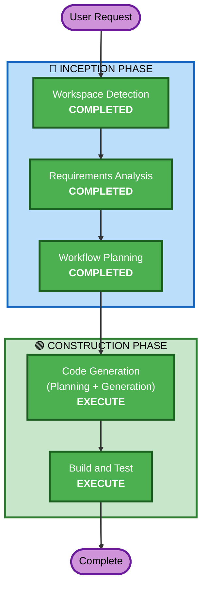

# Execution Plan

## Detailed Analysis Summary

### Transformation Scope
- **Transformation Type**: Single component enhancement + new page
- **Primary Changes**: 폼 validation 강화, 결혼상태 필드 변경, 완료화면 수정, my-profile 페이지 추가
- **Related Components**: types/profile.ts, utils/validation.ts, utils/storage.ts, Step2Household, StepComplete, OnboardingForm, App.tsx, HomePage

### Change Impact Assessment
- **User-facing changes**: Yes - 결혼상태 UI 변경, validation 에러 메시지, 완료화면 버튼, 새 페이지
- **Structural changes**: No - 기존 아키텍처 유지
- **Data model changes**: Yes - `isMarried: boolean` → `marriageStatus: 'single' | 'married' | 'engaged'`
- **API changes**: No
- **NFR impact**: No

### Risk Assessment
- **Risk Level**: Low
- **Rollback Complexity**: Easy (로컬스토리지 마이그레이션만 주의)
- **Testing Complexity**: Simple

## Workflow Visualization

## Phases to Execute

### 🔵 INCEPTION PHASE
- [x] Workspace Detection (COMPLETED)
- [x] Reverse Engineering (SKIPPED - 이전 워크플로우에서 분석 완료)
- [x] Requirements Analysis (COMPLETED)
- [x] User Stories (SKIPPED)
  - **Rationale**: 단일 사용자 유형, 명확한 요구사항, 간단한 Enhancement
- [x] Workflow Planning (COMPLETED)
- [x] Application Design (SKIPPED)
  - **Rationale**: 기존 컴포넌트 경계 내 변경, 새로운 서비스 불필요
- [x] Units Generation (SKIPPED)
  - **Rationale**: 단일 작업 단위, 분해 불필요

### 🟢 CONSTRUCTION PHASE
- [x] Functional Design (SKIPPED)
  - **Rationale**: 간단한 로직 변경, 복잡한 비즈니스 규칙 없음
- [x] NFR Requirements (SKIPPED)
  - **Rationale**: 새로운 NFR 요구사항 없음
- [x] NFR Design (SKIPPED)
  - **Rationale**: NFR Requirements 스킵됨
- [x] Infrastructure Design (SKIPPED)
  - **Rationale**: 인프라 변경 없음
- [ ] Code Generation - EXECUTE (ALWAYS)
  - **Rationale**: 구현 계획 수립 및 코드 생성 필요
- [ ] Build and Test - EXECUTE (ALWAYS)
  - **Rationale**: 빌드 검증 및 테스트 필요

## Estimated Timeline
- **Total Stages to Execute**: 2 (Code Generation, Build and Test)
- **Estimated Duration**: 1 session

## Success Criteria
- **Primary Goal**: 입력폼 validation 강화 및 my-profile 페이지 추가
- **Key Deliverables**: 수정된 폼 컴포넌트, 강화된 validation, 새 my-profile 페이지
- **Quality Gates**: TypeScript 빌드 성공, Vite 빌드 성공
